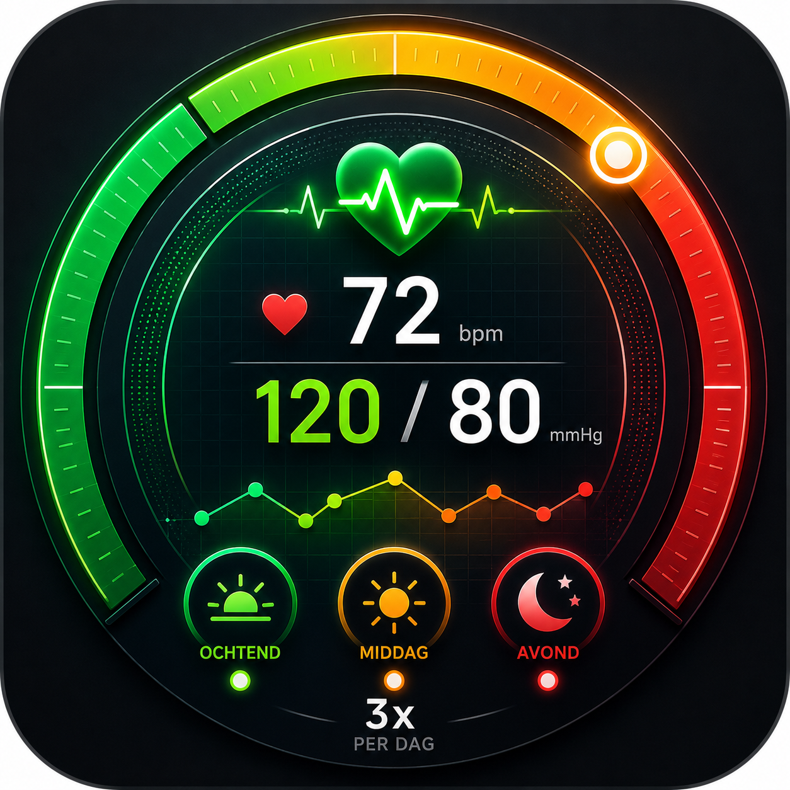

# ❤️ Health Tracker

Een professionele **Bloeddruk & Medicatie Monitor** app voor dagelijks gezondheidsmonitoring.



## ✨ Features

### 📊 Bloeddruk Monitoring
- **Real-time kleurindicaties**: Groene/Oranje/Rode badges die onmiddellijk updaten terwijl je typt
- **3x dagelijks meting**: Ochtend (8:00 AM), Middag (13:00), Avond (20:00)
- **Visuele feedback**: Systolisch/Diastolisch/Hartslag invoer
- **Trends zien**: Alle metingen bewaard per dag

### 💊 Medicatie Tracking
- **Belsar 20 mg**: Dagelijkse inname registratie
- **Visuele pil-counter**: 49 pillen grafisch weergegeven
- **Automatisch tellen**: Pil verdwijnt bij inname, terugkomt bij verwijdering
- **Status alerts**: Groen (OK) → Oranje (Laag ≤10) → Rood (Kritiek <5)

### 📅 Kalender Interface
- **Maandweergave**: Scroll door maanden (2024-2060)
- **Kleurgecodeerd**: Groene/Oranje/Rode dagen tonen bloeddruk status
- **Weekends**: Grijs gemarkeerd voor duidelijkheid
- **Feestdagen**: Geel gemarkeerd met feestnaam
- **Vandaag**: Blauw gemarkeerd

### 💾 Data Opslag
- **LocalStorage**: Alle data persistent opgeslagen in browser
- **Automatisch opslaan**: Data slaat direct op bij invoer
- **Privacy**: Geen cloud sync zonder jouw toestemming

### 📱 Mobile First Design
- **Fully responsive**: Perfect op alle telefoonmaten
- **PWA**: Installeerbaar als app op home screen
- **Offline**: Werkt ook zonder internet
- **Dark mode**: Nachtmode friendly interface

---

## 🚀 Quickstart

### Lokaal Gebruiken
1. Download alle bestanden
2. Open `index.html` in browser
3. Of: Zet op lokale server
   ```bash
   python -m http.server 8000
   # of
   npx http-server
   ```

### Als App Installeren
**Android (Chrome):**
1. Open in Chrome
2. Menu (3 dots) → "Install app"
3. Icon verschijnt op home screen

**iPhone (Safari):**
1. Open in Safari
2. Share → "Add to Home Screen"
3. Icon verschijnt op home screen

---

## 📁 Bestanden

```
├── index.html                    # Entry point (redirect)
├── blood-pressure-tracker.html   # Main app
├── manifest.json                 # PWA manifest
├── sw.js                         # Service worker (offline)
├── logo.png                      # App icon
├── README.md                     # Dit bestand
└── .gitignore                    # Git ignore
```

---

## 🎯 Hoe te Gebruiken

### 1. Kalender Scherm
- Zie alle dagen van de maand
- Groen = OK bloeddruk
- Oranje = Matig
- Rood = Slecht
- Click dag → Day view

### 2. Day View Scherm
- **Medicatie**: Registreer inname uur (08:30)
- **Ochtend (8:00)**: Voer Sys/Dia/HR in
- **Middag (13:00)**: Zelfde
- **Avond (20:00)**: Zelfde
- Kleur badge update **LIVE** terwijl je typt!

### 3. Kleurindicaties
```
🟢 GROEN (OK)
   Systolisch < 130 EN Diastolisch < 85

🟠 ORANJE (Matig)
   Systolisch 130-159 OF Diastolisch 85-99

🔴 ROOD (Slecht)
   Systolisch ≥ 160 OF Diastolisch ≥ 100
```

---

## 💊 Medicatie Management

**Belsar 20 mg - Dagelijks**

Volg je voorraad:
- **49 pillen totaal** (start aantal)
- **Visueel**: 49 paarse cirkels
- Bij inname: Pil wordt grijs & klein
- Status: 🟢 OK (>10) → 🟠 Laag (5-10) → 🔴 Kritiek (<5)

---

## 🔐 Privacy & Data

- ✅ **Lokale opslag**: Alle data in jouw browser
- ✅ **Geen cloud sync**: Privacy guaranteed
- ✅ **Geen tracking**: Geen analytics
- ✅ **Exporteerbaar**: Download je data wanneer je wilt

---

## 🌐 GitHub Pages Deployment

1. Push naar GitHub repo
2. Settings → Pages → Source: main branch
3. App beschikbaar op: `https://[username].github.io/[repo]`

---

## 📊 Toekomstige Features (In Development)

- 📧 Email reminders (12:00, 18:00, 22:00)
- 💬 Telegram alerts
- 📈 Grafieken & trends analyse
- ☁️ Google Drive backup
- 🔄 Cloud sync optie
- 📱 Native apps (iOS/Android)

---

## 🛠 Technologie

- **HTML5**: Semantic markup
- **CSS3**: Tailwind CSS
- **JavaScript**: Vanilla JS (geen dependencies)
- **LocalStorage API**: Data persistentie
- **Service Worker**: Offline support
- **PWA**: Progressive Web App

---

## 📝 Licentie

Dit project is gemaakt voor persoonlijk gezondheidsgebruik.

---

## 📞 Support

Voor vragen of bugs:
1. Check bestaande issues
2. Create new issue op GitHub
3. Include screenshot + beschrijving

---

## ✅ Checklist bij Update

Voordat je pusht naar GitHub:

- [ ] Logo aanwezig (logo.png)
- [ ] HTML heeft logo referentie
- [ ] manifest.json correct geconfigureerd
- [ ] sw.js aanwezig
- [ ] index.html redirect werkt
- [ ] Alle data LocalStorage gebruikt
- [ ] No external APIs (tenzij opt-in)

---

**Geniet van je gezondheidsmonitoring! ❤️**

Made with ❤️ for personal health tracking.
